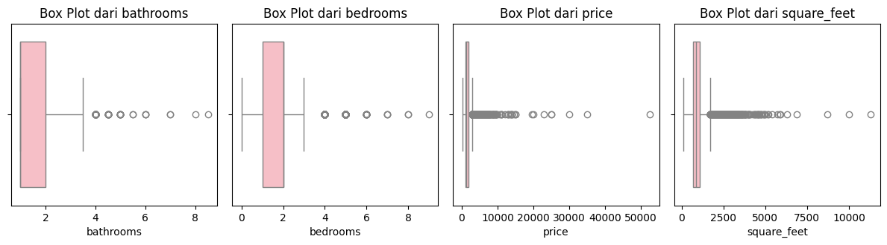
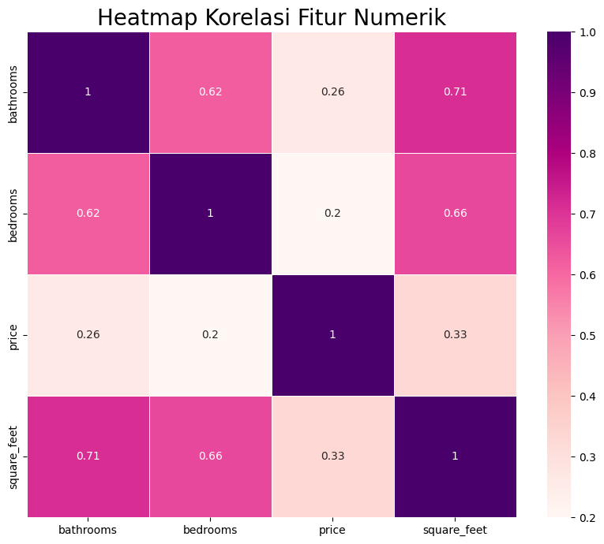
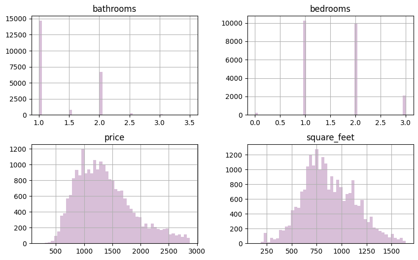

# Laporan Proyek Prediksi Harga Sewa Apartemen

## Domain Proyek
### Latar Belakang
Pasar properti, sebagai sektor yang penting dan dinamis, berperan besar dalam perekonomian, dengan harga menjadi faktor kunci yang mempengaruhi berbagai pemangku kepentingan. Prediksi harga properti sebelumnya didasarkan pada model statistik dan matematis tradisional, seperti regresi dan penilaian harga hedonis, yang menjadi dasar untuk memahami faktor-faktor yang mempengaruhi penilaian properti. Namun, seiring dengan kemajuan daya komputasi dan munculnya teknik machine learning (ML), model-model tradisional ini kini dilengkapi dengan metode yang lebih canggih. Machine learning, terutama teknik seperti neural networks, deep learning, dan gradient boosting, telah terbukti meningkatkan akurasi prediksi, terutama dengan ketersediaan dataset yang lebih besar. Selain itu, penggunaan data time-series yang memperhitungkan fluktuasi harga dari waktu ke waktu menandai kemajuan signifikan dalam prediksi harga properti. Oleh karena itu, pengembangan sistem prediksi harga sewa apartemen menggunakan machine learning menjadi sangat penting untuk membantu pemilik properti dan penyewa membuat keputusan yang lebih baik dan lebih efisien.

### Mengapa Masalah Ini Harus Diselesaikan?
- Penetapan harga sewa yang akurat sangat penting untuk mencegah kerugian bagi kedua belah pihak, baik pemilik properti maupun penyewa.
- Memiliki sistem prediksi harga yang tepat dapat meningkatkan efektivitas pasar penyewaan properti dengan mempermudah proses penentuan harga yang sesuai.

### Referensi Terkait
- [MACHINE LEARNING FOR PROPERTY PRICE PREDICTION AND PRICE VALUATION: A SYSTEMATIC LITERATURE REVIEW](https://www.researchgate.net/publication/355373964_MACHINE_LEARNING_FOR_PROPERTY_PRICE_PREDICTION_AND_PRICE_VALUATION_A_SYSTEMATIC_LITERATURE_REVIEW)
- [Machine Learning for Housing Price Prediction](https://www.researchgate.net/publication/367317216_Machine_Learning_for_Housing_Price_Prediction)

## Business Understanding
### Problem Statements
- Bagaimana cara memprediksi harga sewa apartemen berdasarkan fitur-fitur seperti jumlah kamar mandi, kamar tidur, luas apartemen, dsb?
- Fitur-fitur apa saja yang paling berpengaruh dalam menentukan harga sewa apartemen?
- Bagaimana cara meningkatkan akurasi prediksi harga sewa dengan menggunakan teknik machine learning yang canggih seperti K-Nearest Neighbors, Random Forest, atau Boosting?

### Goals
- Mengembangkan model machine learning yang mampu memprediksi harga sewa apartemen dengan tingkat akurasi yang tinggi, berdasarkan fitur-fitur yang relevan.
- Menentukan fitur-fitur yang memiliki pengaruh terbesar dalam penentuan harga sewa.
- Meningkatkan akurasi model prediksi dengan melakukan penyesuaian hyperparameter dan menggunakan teknik machine learning yang sesuai.

### Solution Statements
- Menerapkan berbagai algoritma machine learning seperti KNN, Random Forest, dan AdaBoost untuk memprediksi harga sewa.
- Membandingkan kinerja model dan memilih model terbaik berdasarkan metrik evaluasi seperti Mean Squared Error (MSE).

## Data Understanding

### Dataset
Dataset yang digunakan diperoleh dari Kaggle dan berisi informasi mengenai apartemen yang disewakan, termasuk fitur-fitur seperti jumlah kamar mandi, kamar tidur, luas apartemen, dan harga sewa. Dataset ini memiliki 100.000 baris dan 22 kolom, namun hanya 25.000 baris yang digunakan dalam analisis.

| Column         | Dtype    |
|----------------|----------|
| id             | int64    |
| category       | object   |
| title          | object   |
| body           | object   |
| amenities      | object   |
| bathrooms      | float64  |
| bedrooms       | float64  |
| currency       | object   |
| fee            | object   |
| has_photo      | object   |
| pets_allowed   | object   |
| price          | int64    |
| price_display  | object   |
| price_type     | object   |
| square_feet    | int64    |
| address        | object   |
| cityname       | object   |
| state          | object   |
| latitude       | float64  |
| longitude      | float64  |
| source         | object   |
| time           | int64    |

### Missing Values
| Tipe Data      | Jumlah Missing Value |
|----------------|----------------------|
| amenities      | 4778                 |
| bathrooms      | 37                   |
| bedrooms       | 20                   |
| pets_allowed   | 13239                |
| address        | 18320                |
| cityname       | 77                   |
| state          | 77                   |
| latitude       | 10                   |
| longitude      | 10                   |

### Outliers
Dataset mengandung nilai outlier pada fitur-fitur numerik, terutama pada fitur `price` dan `square_feet`.

### Variabel yang ada pada dataset dijelaskan sebagai berikut:
1. id : Identifikasi unik untuk listing apartemen
2. category : Kategori dari iklan apartemen
3. title : Nama apartemen
4. body : Deskripsi atau informasi tambahan tentang apartemen
5. amenities*: Fasilitas yang disediakan, seperti AC, lapangan basket, kabel TV, gym, akses internet, kolam renang, lemari es, dll.
6. bathrooms : Jumlah kamar mandi yang tersedia
7. bedrooms : Jumlah kamar tidur yang tersedia
8. currency : Mata uang yang digunakan untuk harga apartemen
9.  fee : Biaya tambahan yang mungkin dikenakan
10. has_photo : Menunjukkan apakah apartemen memiliki foto
11. pets_allowed : Jenis hewan peliharaan yang diizinkan, seperti anjing/kucing, dll.
12. price : Harga sewa apartemen
13. price_display : Harga yang ditampilkan untuk pembaca
14. price_type : Harga yang tertera dalam USD
15. square_feet : Ukuran atau luas apartemen dalam satuan kaki persegi
16. address : Alamat lokasi apartemen
17. cityname : Nama kota tempat apartemen berada
18. state : Nama provinsi tempat apartemen berada
19. latitude : Koordinat lintang lokasi apartemen
20. longitude : Koordinat bujur lokasi apartemen
21. source : Sumber iklan apartemen
22. time : Waktu saat iklan dibuat

### Exploratory Data Analysis (EDA)
- Membuat heatmap korelasi untuk menganalisis hubungan antar fitur numerik
 
    1. Hubungan antara Luas Bangunan dan Fitur Lain: Fitur square_feet (luas bangunan) menunjukkan hubungan yang cukup kuat dengan bathrooms dan bedrooms, yang menunjukkan bahwa luas bangunan dapat menjadi indikator penting dalam menentukan ukuran dan fasilitas apartemen.
    2. Harga Sewa: Korelasi antara harga sewa (price) dan fitur lainnya (kamar mandi dan kamar tidur) relatif rendah. Ini menunjukkan bahwa harga sewa mungkin dipengaruhi oleh faktor-faktor lain seperti lokasi, fasilitas tambahan, atau kondisi pasar yang tidak tercakup dalam fitur yang dianalisis.

- Membuat histogram untuk menganalisis distribusi data numerik
 
    1. Kamar Mandi (Bathrooms):
    * Mayoritas properti memiliki 1 kamar mandi, dengan beberapa properti memiliki 1.5 dan 2.5 kamar mandi.
    * Kamar mandi seharusnya tidak dalam format float, sehingga entri dengan nilai kamar mandi pecahan akan dihapus (drop).
    2. Kamar Tidur (Bedrooms):
    * Mayoritas properti memiliki 1 atau 2 kamar tidur.
    3. Harga Sewa (Price):
    * Harga sewa apartemen tersebar dengan puncak di sekitar 700-1000 USD.
    * Distribusi harga menunjukkan pola normal dengan sedikit skew ke kanan.
    4. Luas (Square Feet):
    * Luas apartemen bervariasi dengan puncak sekitar 500-800 kaki persegi.
    * Distribusi luas juga menunjukkan pola normal dengan skew ke kanan.

#### Korelasi Heatmap
- **Luas Bangunan (square_feet)** memiliki hubungan kuat dengan **bathrooms** dan **bedrooms**.
- **Harga Sewa (price)** memiliki korelasi yang rendah dengan **bathrooms** dan **bedrooms**, menandakan faktor lain seperti lokasi atau fasilitas yang lebih mempengaruhi harga.

#### Histogram
- **Bathrooms**: Mayoritas memiliki 1 kamar mandi.
- **Bedrooms**: Mayoritas memiliki 1 atau 2 kamar tidur.
- **Price**: Harga sewa apartemen tersebar dengan puncak sekitar 700-1000 USD, dengan sedikit skew ke kanan.
- **Square_feet**: Luas apartemen bervariasi, dengan puncak sekitar 500-800 kaki persegi.

## Data Preparation

### Teknik Data Preparation
- **Handling Missing Values**: Mengimputasi atau menghapus nilai yang hilang pada dataset.
- **Removing Outliers**: Menghapus data yang memiliki nilai outliers.
- **Encoding Categorical Variables**: Mengubah variabel kategorikal menjadi numerik menggunakan teknik one-hot encoding.
- **Pembagian Dataset**: Pembagian data train-test dengan rasio 80:20.
- **Feature Scaling**: Melakukan standarisasi pada fitur numerik.

### Proses Data Preparation
1. Fitur dengan missing value < 100 akan di-drop.
2. Fitur dengan missing value > 1000 akan diimputasi.
3. Outlier diatasi menggunakan metode IQR.
4. Fitur seperti `id`, `latitude`, `longitude`, dan `time` di-drop.
5. Kategorikal fitur di-encode menggunakan one-hot encoding.
6. Pembagian data dengan skema 80:20 untuk training dan testing.
7. Feature scaling menggunakan StandardScaler.

### Dataset Pembagian
- **Whole Dataset**: 8136
- **Train**: 6508
- **Test**: 1628

## Modeling

### Tahap Modeling
Algoritma yang digunakan:
- **K-Nearest Neighbors (KNN)**: Parameter `n_neighbors=10`.
- **Random Forest**: Parameter `n_estimators=50, max_depth=16`.
- **AdaBoost**: Parameter `learning_rate=0.05`.

### Kelebihan dan Kekurangan
- **KNN**:
  - Kelebihan: Sederhana, tidak ada asumsi distribusi data.
  - Kekurangan: Sensitif terhadap outliers dan noise.
- **Random Forest**:
  - Kelebihan: Dapat menangani data yang kompleks, robust terhadap overfitting.
  - Kekurangan: Interpretasi model lebih sulit, memerlukan lebih banyak sumber daya.
- **AdaBoost**:
  - Kelebihan: Dapat meningkatkan akurasi dengan menggabungkan beberapa model.
  - Kekurangan: Rentan terhadap outliers.

### Model Terbaik
Berdasarkan evaluasi, **Random Forest** dipilih sebagai model terbaik karena memiliki nilai MSE terendah pada data uji.

## Evaluation

### Metrik Evaluasi
- **Mean Squared Error (MSE)**: Mengukur rata-rata kuadrat dari kesalahan prediksi. MSE yang lebih rendah menunjukkan performa model yang lebih baik.

### Hasil Proyek

| Model          | Train MSE | Test MSE |
|----------------|-----------|----------|
| KNN            | 78.1      | 97.8     |
| Random Forest  | 59.2      | 93.7     |
| AdaBoost       | 148.3     | 156.2    |

### Kesimpulan
- Model Random Forest terbukti menjadi model terbaik dengan MSE terendah.
- Hyperparameter tuning memainkan peran penting dalam meningkatkan performa model.
- Solusi yang diimplementasikan berhasil memenuhi problem statement dan goals yang ditetapkan.

